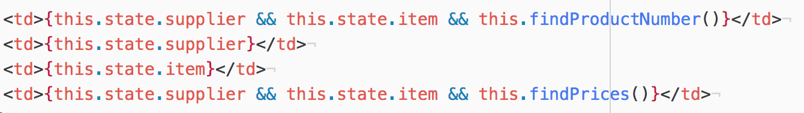
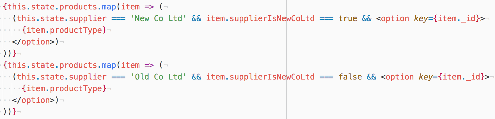

# [JDLT](https://jdlt.co.uk) full-stack developer challenge

The application allows user to select a supplier from the list, followed by a product, and both appear in the table below along with the product number and the product price.

## Dependencies
* NPM / Yarn
## Instructions
From the project root folder:
```
$ npm install
```
OR
```
$ yarn
```

### Technologies used

* ReactJS
* NodeJS
* Express
* MongoDB
* Mongoose
* Chai
* Mocha
* Bootstrap
* Axios

### The Build

I used ReactJS to create a Data component which holds the main content of the application. When the component mounts an axios request is made to the server which returns the full list of suppliers and products produced in the seeds file and saves them to State.

I then used map to iterate over the array of products and suppliers to render them on the dropdown. In order to display a supplier only once, I created a function that creates a new array with a unique list of suppliers only.

Based on the user's choice of supplier, the list of products is then populated. Each product has a property of 'supplierIsNewCoLtd' which is set to either 'true' or 'false'.

<p align="center"></p>

Once a supplier and product have been selected and set to State, the product number and price are then displayed using '.find()'.

<p align="center"></p>

### Extra Features

* I know that JDLT are moving further towards GraphQL, so I would have liked to have completed the challenge using GraphQL, but don't feel in a position to do so currently as I've just started to explore it recently
* Client side testing - I have some experience of testing React components, but given the limited amount of time, I didn't feel confident implementing it at this point
* It would have been interesting to experiment with using serverless technologies for the challenge, but it's not something I've explored in detail as yet

### Challenges

* I had some racing issues, so had to play around with where functions were called and also add conditions so that an action is only performed once State has been set.
* Setting up the environment took a lot longer than I thought it would
